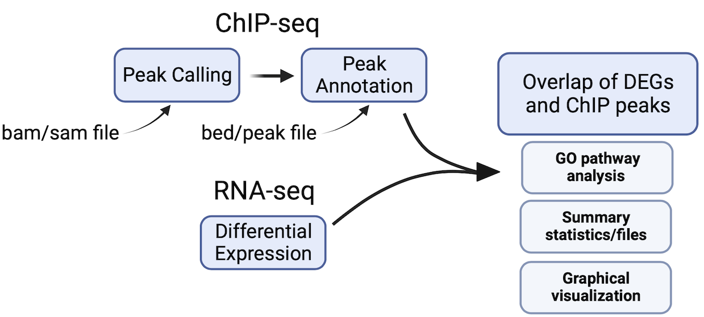
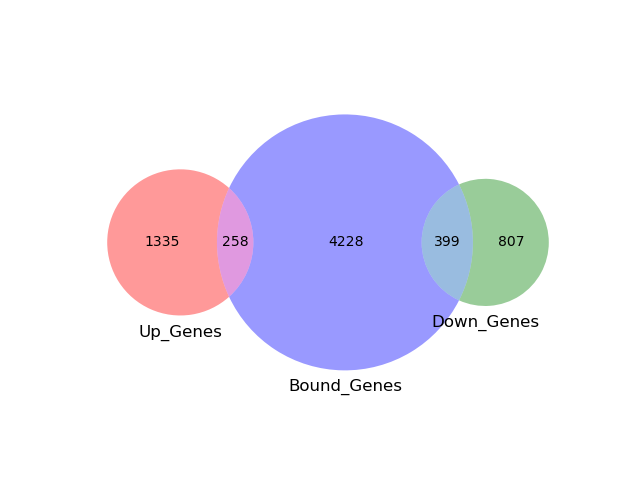
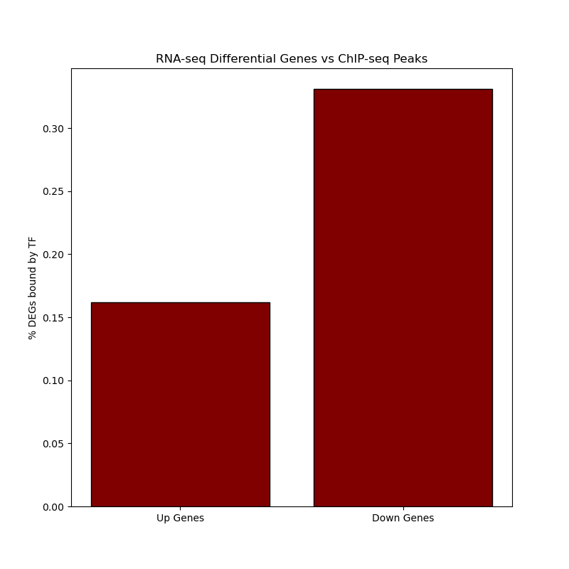
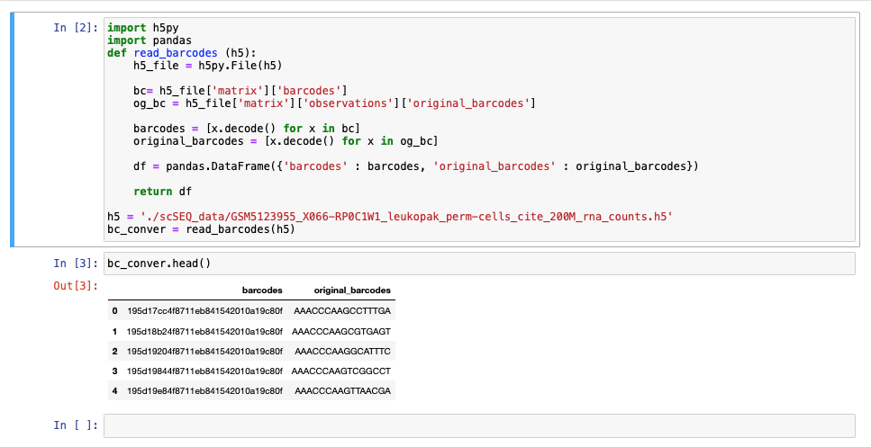
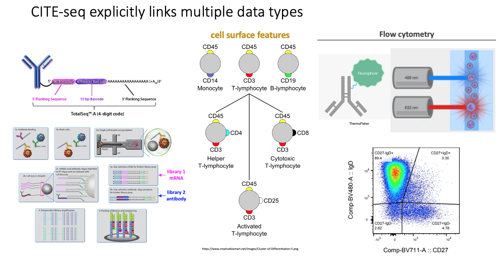
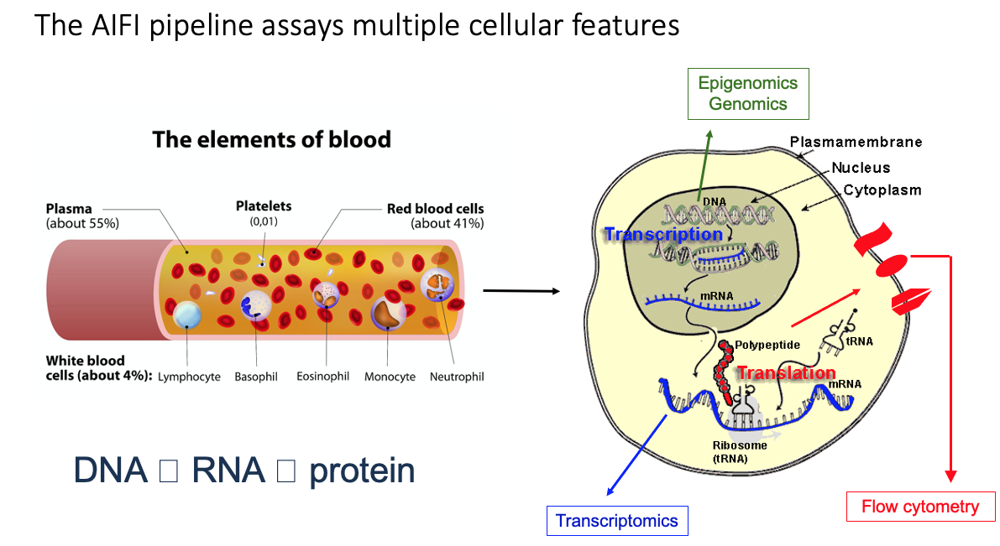
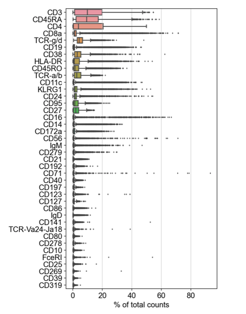
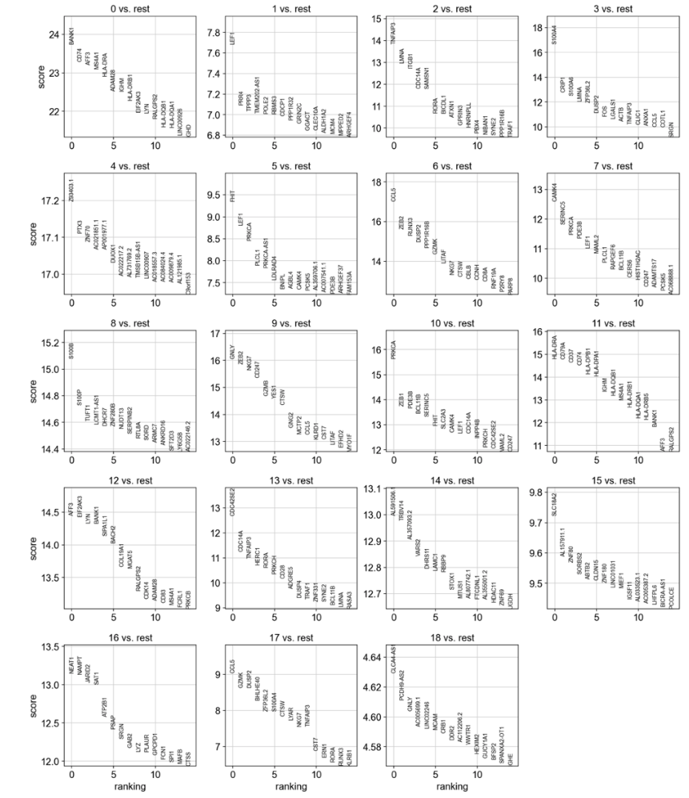
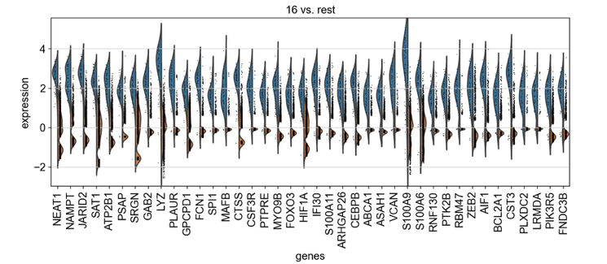

# Multi-Omics Toolkit
A toolkit for the intersection and analysis of omics datasets


## Part 1: Integration of ChIP-seq and RNA-seq datasets

### Description and Rationale:
As omics experiments grow more and more commonplace, the need for tools to integrate these various data modalities has grown. This wrapper script allows for quick and easy integration of two common datasets, bulk RNA-seq and ChIP-seq.


### Overview of Pipeline: ```ChIP_RNA_pipeline.py```
 

```
usage: ChIP_RNA_pipeline.py [-h] -G GFF3_FILE -r RNASEQ_FILE [-b BED_FILE] [-B BAM_FILE] [-f LOG2FC]
                             [-p PVAL]

This is a wrapper script for comparison of RNAseq and ChIPseq data.

If a bam or a sam file is provided from a ChIP-seq experiment, a custom peak calling algorithm will be run.
Otherwise a pre-made bed file may be entered with called ChIP-seq peaks.

An RNAseq file should be provided containing differential expression data
and should be a tab-delimited file containing columns for gene IDs, fold change (log2 transformed), and p values.
If desired, the user may designate custom pval and log2fc cutoffs for downstream analysis.
Otherwise, reasonable default values will be utilized.

This script will annotate called peaks (either from an input bed file or generated from a bam file)
based on the distance to the nearest gene TSS. It will then output many files and graphs
representing overlap and intersections between significant differentially
expressed genes (either up or downregulated) to called ChIP-seq peaks.
Finally, the script will output enriched GO terms for either upregulated bound genes or downregulated bound genes.

options:
  -h, --help      show this help message and exit
  -G GFF3_FILE    Input GFF3 annotation file for genome of ChIP/RNAseq data
  -r RNASEQ_FILE  Input differential gene expression file. Required column format = gene_ID  Log2FC  p-value
  -b BED_FILE     Optional: supply input ChIP seq bed file, if this is not provided, user must provide a .bam file for peak calling
  -B BAM_FILE     Optional: supply input bam file for peak calling before intersection. If this is not provided, user must provide a ChIPseq .bed file
  -f LOG2FC       Optional: supply log2fc cutoff for differentially expressed gene list. Default: 0.585
  -p PVAL         Optional: supply p value cutoff for differentially expressed gene list. Default: 0.05
```


* **Peak Calling:**
Input sam or bam files are run through ```samtools depth```, a function which
returns the locations and read depth of each covered base in the input file.
This output is filtered by removing all bases with a read depth below 6, and
consecutive bases are grouped into peaks and output to a bed file.

* **Peak Annotation:**
ChIP-seq peaks are annotated based on a user input GFF3 genome annotation file.
First, the GFF3 file is parsed using ```gff3_to_TSSbed.py``` which extracts
transcription start site information and gene names from the GFF3 file. Then,
ChIP-seq peaks are annotated to the closest transcription start site using
[bedtools closest](https://bedtools.readthedocs.io/en/latest/content/tools/closest.html) in ```annotate_bed_to_TSS.sh```. 
 
* **Integration of RNA-seq and ChIP-seq:**
The input RNAseq gene list is parsed to identify up and downregulated genes
based on user-defined cutoffs. These lists are then integrated with annotated
ChIP-seq peaks. A number of summary statistics are reported in a summary.txt
file, as well as lists of significant DE genes, and lists of overlap between
upregulated or downregulated genes and annotated peaks. A bar graph and a pie
chart are also generated to visualize overlap between these datasets:

        


* **GO Pathway Analysis of DEGs and ChIP-seq Peaks**
Gene Ontology pathway analysis is performed on lists of overlapping annotated
peaks with either upregulated or downregulated genes. Results are exported
in a table format with relevant statistics:

```
GO_term fold_change     pvalue
GO:0070161      level-03        depth-03        anchoring junction [cellular_component] 4.821307290568866       3.3283419434173545e-09
GO:0005886      level-03        depth-03        plasma membrane [cellular_component]    1.8713643260863588      1.7589741581267755e-08
GO:0016020      level-02        depth-02        membrane [cellular_component]   1.565372257152236       3.452880176773256e-07
GO:0015629      level-06        depth-06        actin cytoskeleton [cellular_component] 4.968408197939896       7.903768061919691e-07
GO:0042995      level-02        depth-02        cell projection [cellular_component]    2.5492854843103747      1.2241457808974728e-06
GO:0009897      level-03        depth-03        external side of plasma membrane [cellular_component]   3.988385412504329       5.073967906570723e-06
```


The environment used to run these scripts can be downloaded using the included [env.yaml](https://github.com/procho/pfbseq/blob/main/share/RNA_ChIP.yaml) file: 
```
conda env create --file RNA_ChIP.yaml --name RNA_ChIP
```
Note: Samtools must be installed separately!


## PART TWO: Single Cell CITE_SEQ to UMAP and GO annotation walkthrough

### Overview

In this overview we will highlight the various functions of scanpy in the analysis of single-Cell RNA-seq data and the creation of UMAP graphs for the scRNA-seq data and Antibody counts.

The data was downloaded from GEO- and is a published dataset from a 5' CITEseq experiment on PBMC Cells. There were two files, one for the RNAseq that was an HDF5 format and a second file of the single cell ADT data that was .CSV. This data was not complete on GEO because the barcodes on the .CSV file were reencoded so it was impossible to correlate the RNAseq counts with the ADT assignment in each single cell across the two datasets.  





 

 


The Antibody/Barcode list is as follows as well as cell counts for each marker:




### 5' RNAseq RNA walkthrough

We will be using the numpy, pandas, scanpy, matplotlib packages all downloadable through conda. Environment set up instructions can be found in jupyterSetUp.md

* Importing Packages into notebook

```python
import numpy as np
import pandas as pd
import scanpy as sc
import matplotlib.pyplot as plt
```
* Reading in the HD5 file with the data

```python
adata = sc.read_10x_h5('/Users/pfb16/final_project/pfbseq/scSEQ_data/GSM5123955_X066-RP0C1W1_leukopak_perm-cells_cite_200M_rna_counts.h5')#replace with path to your dataset
adata.var_names_make_unique()
```
* Annotating mitochondrial genes

```python
adata.var['mt'] = adata.var_names.str.startswith('MT-')  # annotate the group of mitochondrial genes as 'mt'
sc.pp.calculate_qc_metrics(adata, qc_vars=['mt'], percent_top=None, log1p=False, inplace=True)
```
* Filtering data sets based on desired parameters

```python
sc.pp.filter_cells(adata, min_genes=200)# filters out cells with few transcripts
sc.pp.filter_genes(adata, min_cells=3) # filters out genes expressed in few cells
adata = adata[adata.obs.n_genes_by_counts < 2500, :] #Total-count normalize (library-size correct) the data matrix X to 10,000 reads per cell, so that counts become comparable among cells
adata = adata[adata.obs.pct_counts_mt < 5, :]
```

* Normalizing data and accounting for highly variable data

```python
sc.pp.normalize_total(adata, target_sum=1e4) #Logarithmize the data

sc.pp.log1p(adata) #Identify highly-variable genes.

sc.pp.highly_variable_genes(adata, min_mean=0.0125, max_mean=3, min_disp=0.5) # extracting highly variable genes
adata.var.highly_variable.value_counts()

adata = adata[:, adata.var.highly_variable] #Regress out effects of total counts per cell and the percentage of mitochondrial genes expressed. Scale the data to unit variance.

```

* Make a file with all gene names that will be clustered

```python
out_file = 'all_PBMC_genelist.txt'
adata.var[['gene_ids']].to_csv('./all_PBMC_genelist.csv')
```

* Regressing out mitochondrial data

```python
sc.pp.regress_out(adata, ['total_counts', 'pct_counts_mt'])
```

* Clustering

```python
sc.pp.neighbors(adata, n_neighbors=5, n_pcs=7)
sc.tl.umap(adata)
sc.tl.leiden(adata, resolution = 0.8)
```
* Generating UMAP

```python
with plt.rc_context({'figure.figsize': (8, 8)}):
    sc.pl.umap(adata, color=['leiden'],legend_loc='on data')
```


We get clusters and the differentially expressed genes using the wilcoxon method on the leiden clusters shown above.

```python
sc.tl.rank_genes_groups(adata, 'leiden', method='wilcoxon')
sc.pl.rank_genes_groups(adata, n_genes=15, sharey=False)
```
 


### Antibody (ADT) walkthrough

* Reading in .csv file with cell and antibody counts

```python
protein = sc.read_csv('./share/GSM5123955_X066-RP0C1W1_leukopak_perm-cells_cite_48M_adt_counts_fixed.csv')
protein.var_names_make_unique()
```

* Graph of antibody counts

```python
sc.pl.highest_expr_genes(protein, n_top=40, )
```


* Normalization and clustering

```python3
sc.pp.log1p(protein)
sc.pp.pca(protein, n_comps=20)
sc.pp.neighbors(protein, n_neighbors=30)  
sc.tl.leiden(protein,resolution = 0.8)
```

* Creating UMAP

```python
sc.tl.umap(protein)
with plt.rc_context({'figure.figsize': (8, 8)}):
    sc.pl.umap(protein, color=['leiden'],legend_loc='on data')
```


### GO Annotation walkthrough


  
* GO_parser.py

Species-specific GO annotation files (.gaf) are downloaded from http://current.geneontology.org/products/pages/downloads.html. The GO_parser script takes a .gaf file as an input, filters out less-reliable evidence entries, and writes a table with gene symbols and GO ids associated with each gene into GO_parser_{species}.out file.

Example input from a .gaf file:

```
UniProtKB	A0A024RBG1	NUDT4B	enables	GO:0003723	GO_REF:0000043	IEA	UniProtKB-KW:KW-0694	F	Diphosphoinositol polyphosphate phosphohydrolase NUDT4B	NUDT4B	protein	taxon:9606	20230911	UniProt		
UniProtKB	A0A024RBG1	NUDT4B	enables	GO:0046872	GO_REF:0000043	IEA	UniProtKB-KW:KW-0479	F	Diphosphoinositol polyphosphate phosphohydrolase NUDT4B	NUDT4B	protein	taxon:9606	20230911	UniProt		
UniProtKB	A0A024RBG1	NUDT4B	located_in	GO:0005829	GO_REF:0000052	IDA		C	Diphosphoinositol polyphosphate phosphohydrolase NUDT4B	NUDT4B	protein	taxon:9606	20230619	HPA		
UniProtKB	A0A075B6H7	IGKV3-7	involved_in	GO:0002250	GO_REF:0000043	IEA	UniProtKB-KW:KW-1064	P	Probable non-functional immunoglobulin kappa variable 3-7	IGKV3-7	protein	taxon:9606	20230911	UniProt		
UniProtKB	A0A075B6H7	IGKV3-7	located_in	GO:0005886	GO_REF:0000044	IEA	UniProtKB-SubCell:SL-0039	C	Probable non-functional immunoglobulin kappa variable 3-7	IGKV3-7	protein	taxon:9606	2023091UniProt		
UniProtKB	A0A075B6H7	IGKV3-7	part_of	GO:0019814	GO_REF:0000043	IEA	UniProtKB-KW:KW-1280	C	Probable non-functional immunoglobulin kappa variable 3-7	IGKV3-7	protein	taxon:9606	20230911	UniProt
UniProtKB	A0A075B6H8	IGKV1D-42	involved_in	GO:0002250	GO_REF:0000043	IEA	UniProtKB-KW:KW-1064	P	Probable non-functional immunoglobulin kappa variable 1D-42	IGKV1D-42	protein	taxon:9606	20230911	UniProt	
```

Example lines from GO_parser_human.out:

```
NUDT4B	GO:0046872	GO:0005634	GO:0005737	GO:1901909	GO:1901907	GO:0000298	GO:1901911	GO:0005829	GO:0034431	GO:0008486	GO:0003723	GO:0071543	GO:0034432	
IGKV3-7	GO:0002377	GO:0002250	GO:0019814	GO:0005886	GO:0005615	GO:0006955	
IGKV1D-42	GO:0002377	GO:0002250	GO:0019814	GO:0005886	GO:0005615	GO:0006955	
IGLV4-69	GO:0002377	GO:0002250	GO:0019814	GO:0005886	GO:0005615	GO:0006955
```

* in the master script, sample gene list(s) and a control gene list is provided together with species information ("human" or "mouse"). A species-specific gene:GO dictionary is generated from parsing the GO_parser_{species}.out file. Gene lists (samples and control) are
 passed to GO_enrich_analyzer.py script (which calls functions in GO_counter.py script) for GO enrichment analysis. Output is formatted and written into *.out files.

* GO_counter.py

User-provided gene list and a species-specific gene:GO dictionary are passed to the GO_count function. Count for each GO term will be stored in a dictionary and returned. Description for each GO id is added in the resulting dictionary.

* GO_enrich_analyzer.py

Calculates fold enrichment for each GO term, in sample gene list compared to a control gene list.

Performs Fisher's exact test for statistical significance.

```
    fold_enrichment = (GOcount_sample/gene_num_sample) / (GOcount_ctrl/gene_num_ctrl)

    # Fisher's exact test, obtain p value
    a = GOcount_sample
    b = GOcount_ctrl
    c = gene_num_sample - GOcount_sample
    d = gene_num_ctrl - GOcount_ctrl
    table = [[a,b],[c,d]]
    Fisher_result = fisher_exact(table)
    p = Fisher_result.pvalue

    GO_results_Dict[GO]["fold_enrich"] = fold_enrichment
    GO_results_Dict[GO]["pvalue"] = p
```

Rank results based on p value.

```
  GO_list_sorted = sorted(GO_list, key=lambda x:GO_results_Dict[x]["pvalue"])
  GO_results_Dict_sorted = {}
```

Output for each analysis (sample-control pair) is a dictionary of GO terms and corresponding fold change and p value.

* Example output 
Analysis of differentially expressed genes in single-cell CITE-seq cluster 16 (monocytes) against full human transcript control:
```
GO_term	fold_change	pvalue
GO:0006954	level-04	depth-04	inflammatory response [biological_process]                                       	2.988433870013391	1.2160988713217279e-10
GO:0006959	level-03	depth-03	humoral immune response [biological_process]                                     	6.516460434646979	3.4238487627070136e-08
GO:0006968	level-04	depth-04	cellular defense response [biological_process]                                   	7.067484662576688	3.7155531820458623e-08
GO:0071222	level-05	depth-06	cellular response to lipopolysaccharide [biological_process]                     	3.786458449525935	4.7771150752213405e-08
GO:0009897	level-03	depth-03	external side of plasma membrane [cellular_component]                            	2.599491720219499	1.6863065448022272e-07
GO:0031663	level-04	depth-06	lipopolysaccharide-mediated signaling pathway [biological_process]               	8.480981595092025	1.6967376046769924e-07
GO:0007165	level-02	depth-04	signal transduction [biological_process]                                         	1.8084446048357994	2.908987739030095e-07
GO:0032760	level-07	depth-11	positive regulation of tumor necrosis factor production [biological_process]     	4.476073619631903	3.249917599069161e-07
GO:0050911	level-05	depth-05	detection of chemical stimulus involved in sensory perception of smell [biological_process]	0.054861753088494836	4.4121980686520505e-07
GO:0050729	level-06	depth-07	positive regulation of inflammatory response [biological_process]                	4.552948014207297	5.31037443254554e-07
GO:0030335	level-06	depth-06	positive regulation of cell migration [biological_process]                       	3.0430305141050717	5.457847606454605e-07
GO:0043231	level-04	depth-04	intracellular membrane-bounded organelle [cellular_component]                    	1.9179718924666496	6.359558992633836e-07
GO:0004984	level-04	depth-04	olfactory receptor activity [molecular_function]                                 	0.05511341250633196	6.933796500453682e-07
GO:1904813	level-05	depth-05	ficolin-1-rich granule lumen [cellular_component]                                	3.8757173956065705	1.206167847769409e-06
GO:0050852	level-06	depth-10	T cell receptor signaling pathway [biological_process]                           	4.004907975460123	1.4389976796646613e-06
GO:0031267	level-05	depth-05	small GTPase binding [molecular_function]                                        	2.7075434200293786	1.476835158261376e-06
GO:0006468	level-05	depth-06	protein phosphorylation [biological_process]                                     	2.421572264231702	1.8621925629922682e-06
GO:0001772	level-02	depth-02	immunological synapse [cellular_component]                                       	6.407852760736196	2.0588800414326198e-06
GO:0050853	level-06	depth-10	B cell receptor signaling pathway [biological_process]                           	5.578264680105172	2.9262402266192248e-06
GO:0044194	level-08	depth-08	cytolytic granule [cellular_component]                                           	15.291466815393198	3.42543382076906e-06
GO:0045766	level-06	depth-07	positive regulation of angiogenesis [biological_process]                         	3.4574745111885954	5.712260232527397e-06
GO:0034774	level-06	depth-06	secretory granule lumen [cellular_component]                                     	3.761130968258202	5.9155968441707734e-06
GO:0005829	level-02	depth-02	cytosol [cellular_component]                                                     	1.2651750670675799	7.791940664536377e-06
GO:0004930	level-04	depth-04	G protein-coupled receptor activity [molecular_function]                         	0.2762005500317326	8.274754145817857e-06
GO:0045429	level-07	depth-07	positive regulation of nitric oxide biosynthetic process [biological_process]    	6.8655565293602105	8.776351816773922e-06
GO:0032753	level-06	depth-10	positive regulation of interleukin-4 production [biological_process]             	8.009815950920245	8.839452393740854e-06
GO:0030667	level-05	depth-06	secretory granule membrane [cellular_component]                                  	4.004907975460123	9.598488246571803e-06
GO:0005794	level-05	depth-05	Golgi apparatus [cellular_component]                                             	1.745023690975755	1.0497972098453242e-05
GO:0032755	level-06	depth-10	positive regulation of interleukin-6 production [biological_process]             	3.9231751596344067	1.2075706093121144e-05
GO:0045121	level-04	depth-04	membrane raft [cellular_component]                                               	2.869187803314715	1.2488971674205584e-05
GO:0045087	level-03	depth-06	innate immune response [biological_process]                                      	2.1304458921004366	1.280694494407189e-05
GO:0019899	level-03	depth-03	enzyme binding [molecular_function]                                              	2.334289219982472	1.5802956399739273e-05
GO:0004888	level-03	depth-03	transmembrane signaling receptor activity [molecular_function]                   	3.1617694543106234	1.8639862255543776e-05
GO:0048306	level-03	depth-03	calcium-dependent protein binding [molecular_function]                           	4.258383163780383	1.8687695898381596e-05
GO:0007254	level-06	depth-08	JNK cascade [biological_process]                                                 	4.971609900571187	1.923583880388119e-05
GO:0035556	level-03	depth-05	intracellular signal transduction [biological_process]                           	2.2527607361963193	2.080250822297233e-05
```


 


